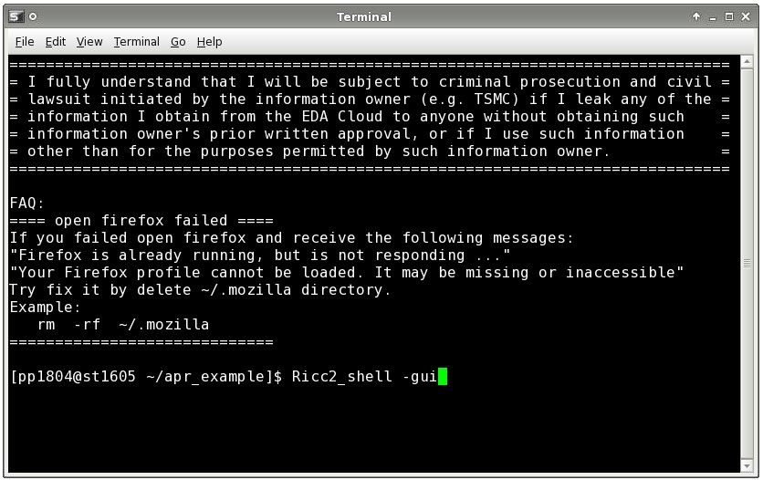
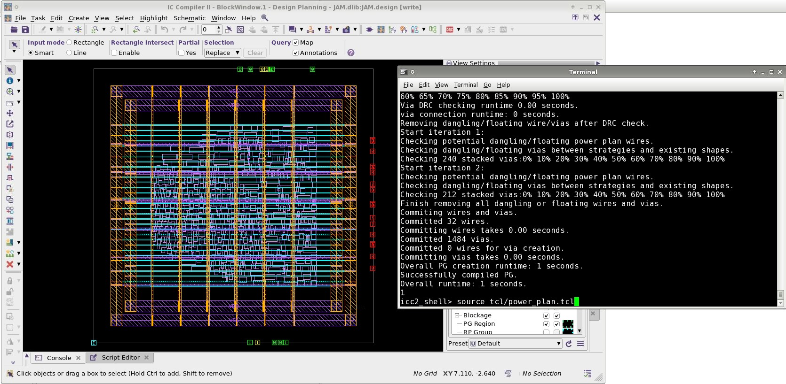
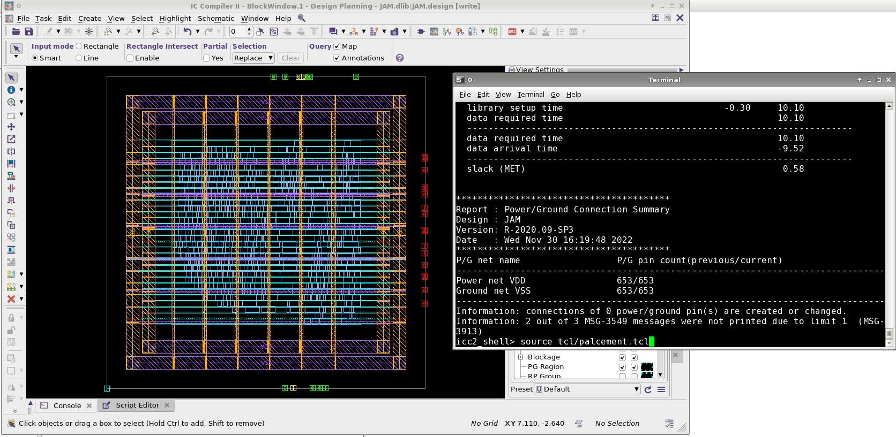
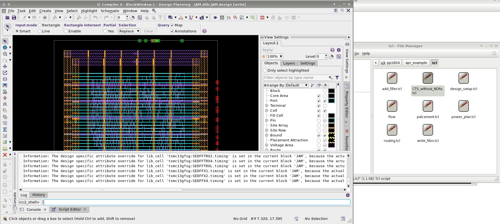
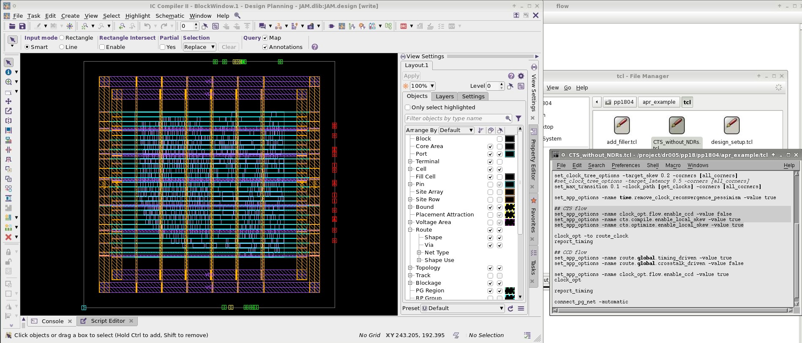
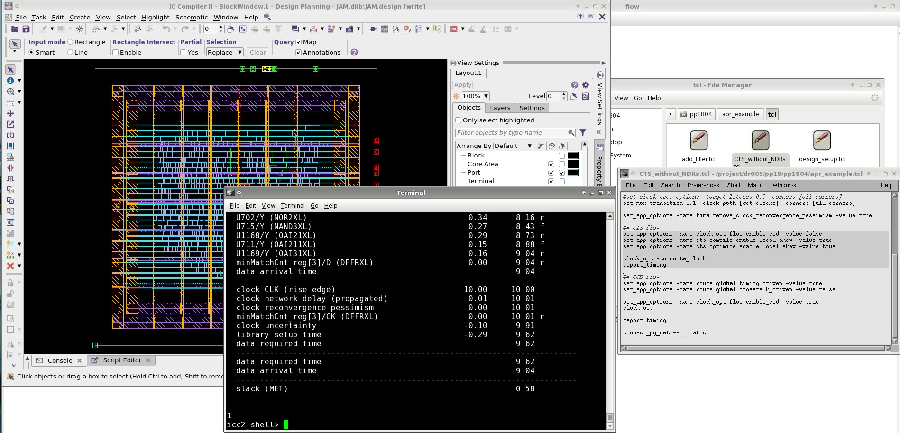
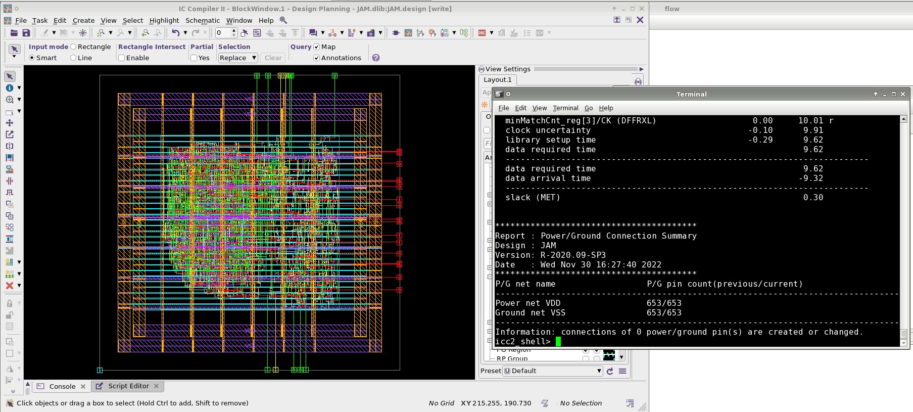
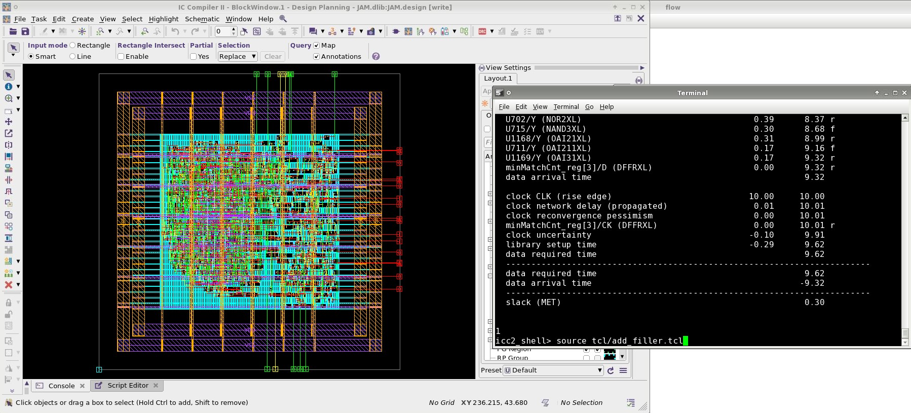
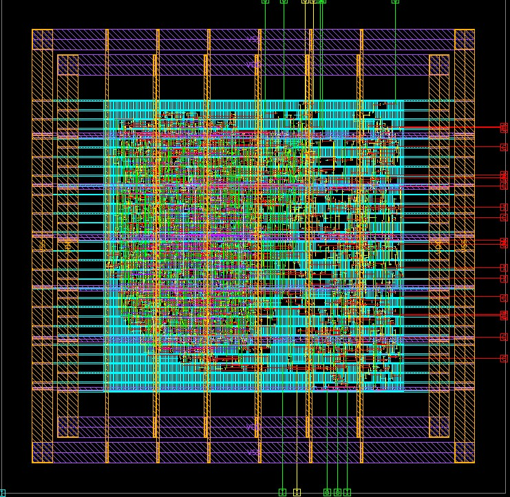

# APR tips and tricks
## Prerequisites
1. You must pass your synthesis flow and generate two important files. design.sdc.v and design.syn.v
2. Your sdc file must contain some important INFOs
   1. Set-up uncertainty i.e. hold up time info and setup time infos
   2. Clock uncertainty, source uncertainty and internal uncertainty. These are uncertainty related to clock trees and internal wires.
   3. Input transitions
   4. Output Loads(The output capacitances)
   5. Input delays and output delays. (The constraint you want to give other people to use)

## APR flow
0. Start the IC compiler using command at the where you have sdc and syn file.



1. After preparing your design and its generated sdc and syn files, try to run the scripts prepared.
```
    1. design setup
    2. power_plan
    3. placement
    4. CTR_without_NDRs
    5. routing
    6. add_filler
    7. write_files
```

# Design setup.
1. When setting up design, in the sdc file, you must first comment some command to allow CTS to work properly.
   1. Change all of the design name to your own design name.
   2. Set ideal network command shall be removed.
   3. write_sdc -venum fName.sdc


# Power plan
1. -core_utilization sets the center core cell area within the chip pad set 0.1~1, this would set up the usage of cell area for your core.
2. This would generate the Vdd and Vss power rail line for your design


# Placement
1. This helps auto place the cell in a good manner.


# CTS
1. Generating the clock tree.
2. When using the tcl file, the tcl file is divided into three parts.
   1. Basic setup
   2. CTS or CCD flow
   3. connect_pg_net -automatic

3. Set dont touch off allows APR tool to do optimization on the clock tree.


## Basic setup sets the basic config for the APR software
1. Basic commands which generates the clock tree and add CLK buffers to your clock tree.
2. This would add skew + jitter + margin of the PLL and clock tree into consideration.
## CTS flow
1. Normal clock tree synthesis, it would insert buffers between the generated clock tree routes.

## CCD flow
1. Dont know, read documentation.
## connect_pg_net -automatic
1. Automatically place and route the cells in an ordered manner.



# Routing
1. Routes your design cells with the power rail, timing report will be generated during this process.
2. In this timing report, the biggest difference occurs in the time borrowing from the clock tree.
3. Also there would be a clock tree penalty within the report.



# Add filler
1. Because after routing and placing, there are lots of gap between the wires, one must fill up the gap s.t. the wires would not collapse into each other.



# APR Result
