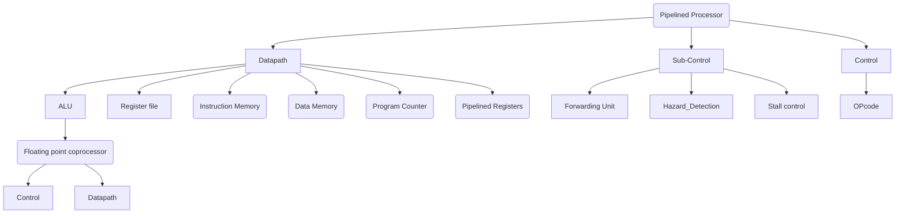

# NCHU VLSI CAD Final project

## Index

## Introduction
1. A 16-bit 5-stage pipelined RISC Processor with floating point coprocessor is implemented, using a small set of Custom RISC ISA. In order to enhance performace, forwarding unit and hazard detection unit are also implemented to resolve the data hazard and control hazard.

2.  The coprocessor is implemented using simplfied 16-bit IEEE format as an additional module.


## 5-stage RISC pipelined Processor


# Datapath
1. Main Datapath


# Controlpath
## CTR


## Hazard Unit


# Forwarding Condition
>To solve Data hazard including R-R sw-lw

ALU_src1:
```verilog
    if((rsE!=0)and(rsE == WriteRegM) and (RegWriteM))
        ALU_src1 = 01
    else if ((rsE!=0) and (rsE == WriteRegW) and RegWriteW)
        ALU_src1 = 10
    else
        ALU_src1 = 00
```

ALU_src2:
```verilog
    if((rsE!=0)and(rsE == WriteRegM) and (RegWriteM == 1))
        ALU_src2 = 01
    else if ((rsE!=0) and (rsE == WriteRegW) and RegWriteW == 1)
        ALU_src2 = 10
    else
        ALU_src2 = 0
```

MemSrc:
> To solve sw-lw data hazard
```verilog
    if((rsM!=0) and (rsM == WriteRegW) and (MemRead == 1))
        MemSrc = 1
    else
        MemSrc = 0
```


## Stall Condition
> To solve lw-r data hazard and stop signal

```verilog
    if(stop)
        stall Every Pipeline and PC
    else if( ((rsI == rsE) and (rsI!=0)) or ((rsI == rsE) and (rtI != 0 )) and (MemRead == 1))
        stall PC and flush ID/EX
    else
        do nothing
```

## Control Hazard Control
> To solve j and branch hazard

```verilog
    if(jump == 1)
        flush IF/ID
    else if (PCSrc == 1)
        flush EX/MEM for 3 cycles
    else
        do nothing
```


# Testbench
# References
