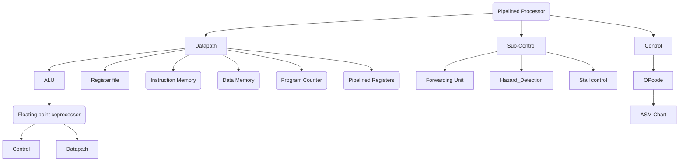

# NCHU VLSI CAD Final project

## Index

## Introduction
1. A 16-bit 5-stage pipelined RISC Processor with floating point coprocessor is implemented, using a small set of Custom RISC ISA. In order to enhance performace, forwarding unit and hazard detection unit are also implemented to resolve the data hazard and control hazard.

2.  The coprocessor is implemented using simplfied 16-bit IEEE format as an additional module.

## 5-stage RISC pipelined Processor

### Instruction set architecture

### Datapath

### Controlpath

## 16-bit floating point Coprocessor

### Specification

### Datapath

### Controlpath

## Testbench
# VLSI_CAD_Project
