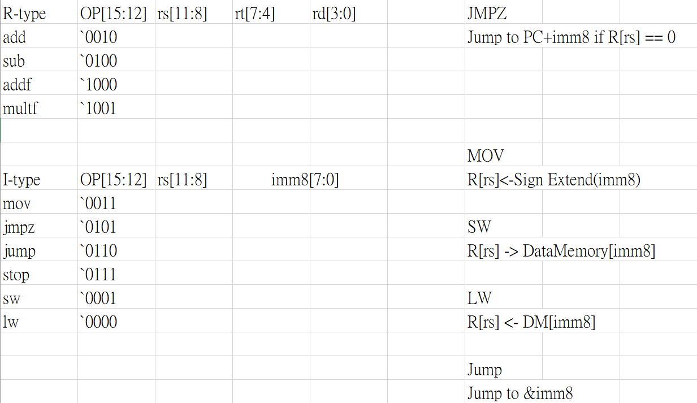
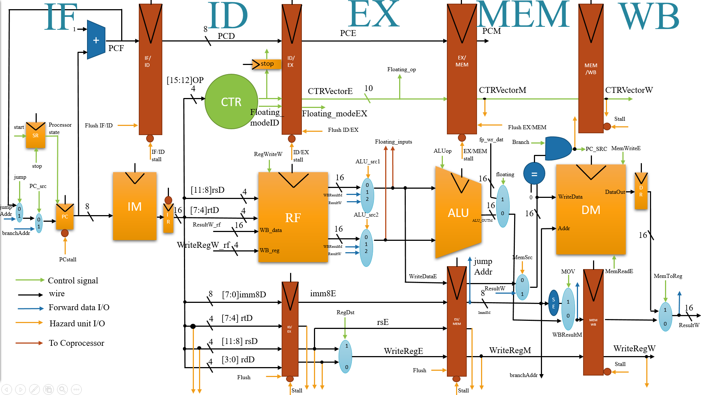
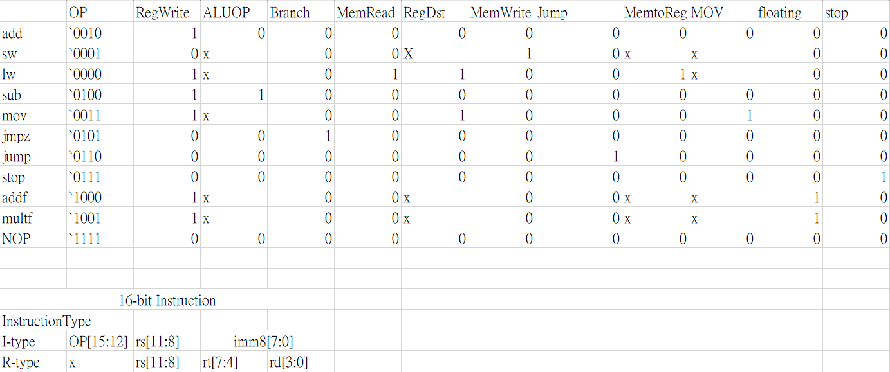

# NCHU VLSI CAD Final project

## Index
1. [Introduction](#introduction)
2. [Datapath](#datapath)
3. [Controlpath](#controlpath)
4. [TestBench](#testbench)
5. [Synthesis](#synthesis-result)
6. [APR](#apr)


## Introduction
1. A 16-bit 5-stage pipelined RISC Processor with floating point coprocessor is implemented, using a small set of Custom RISC ISA. In order to enhance performace, forwarding unit and hazard detection unit are also implemented to resolve the data hazard and control hazard.

2.  The coprocessor is implemented using simplfied 16-bit IEEE format as an additional module.

3. To start the processor, raise the input start signal to 1, the flag would get stored inside the state Register(SR) to ensure the processor keeps on running.

4. The stop signal is a part of instruction, it would get decoded at ID stage. After stopping the processor, everything would get stalled.

5. Specially note we jump at MEM stage for jmpz and jump no matter what, so the jump signal needs to be propogate throughout the pipeline.


## 5-stage RISC pipelined Processor
### ISA


### System tree diagram


### Processor block diagram
<br />

# Datapath
1. Main Datapath


# Controlpath
## CTR Signal and corresponding Control vector


## Hazard Unit


# Forwarding Condition
>To solve Data hazard including R-R,sw-lw

ALU_src1:
```verilog
    // In this ISA, lw does not need forwarding. also $0 can store value other than 0. Different from MIPS.
    if((rsE == WriteRegM) and (RegWriteM == 1) and (MemReadE != 1))
        ALU_src1 = 01
    else if ((rsE == WriteRegW) and (RegWriteW ==1 ) and (MemReadE != 1))
        ALU_src1 = 10
    else
        ALU_src1 = 00
```

ALU_src2:
```verilog
    if((rtE == WriteRegM) and (RegWriteM == 1) and (MemReadE != 1))
        ALU_src2 = 01
    else if ((rtE == WriteRegW) and (RegWriteW == 1) and (MemReadE != 1))
        ALU_src2 = 10
    else
        ALU_src2 = 00
```

MemSrc:
> To solve sw-lw data hazard
```verilog
    if((rsM == WriteRegW) and (MemReadW == 1) and (MemWriteM == 1))
        MemSrc = 1
    else
        MemSrc = 0
```


## Stall Condition
> To solve lw-r data hazard and stop signal

```verilog
    if(stop)
        stall Every Pipeline and PC
    else if( ((rsD==rsE) or (rtD == rsE)) and (MemReadE == 1) and (ID stage is R-type))
        stall PC and flush ID/EX
    else
        do nothing
```

## Control Hazard Control
> To solve j and branch hazard

```verilog
    if (PCSrc == 1 || jump == 1)
        flush EX/MEM and flush IF/ID and stallPC for 3 cycles
    else
        do nothing
```

### Debug notes
1. stop register is added , the reason is that stop signal can only be decoded in ID stage, however the stop signal needs to be read during IF stage for PC, otherwise it cannot know which state it is in.

2. Processor Status Register(SR) is added s.t. we can know whether processor is running or not, if it is not running, PC would be locked.

3. Any kind of control signal had better be kept using a status register to prevent some error, otherwise unexpected erros might occur due to unknown value given.

4. You forget to redesign the RF file s.t. it can write at negedge and read at positive edge.

5. When executing Instructions, you should give enough nop before stop for previous instructions to actually complete.

6. When specifying components, you MUST first UNIT Test every Components before putting them into actions. Just give them some simple testbench s.t. you are sure that they are working as expected. THIS WOULD SAVE YOU TONS OF TIME!!!!!!!! I didnt notice that RF is not blocked.

7. Remember to check whether you have used the right testbenches or whether you have correct the testbenches into the right one.

8. Original design has problem with jump. You had better put branches at the same location to prevent errors!

# Testbench
Look at 16-bit-pipelined-processer/sim

# Synthesis Result
## Area

## Power

## Timing

### Slack


# APR


# References
```
[1] Yamin Li and Wanming Chu, "Aizup-a pipelined processor design and implementation on XILINX FPGA chip," 1996 Proceedings IEEE Symposium on FPGAs for Custom Computing Machines, 1996, pp. 98-106, doi: 10.1109/FPGA.1996.564755.

[2] N. Manjikian and J. Roth, "Performance enhancement and high-level specification of a pipelined processor in programmable logic," 2007 IEEE Northeast Workshop on Circuits and Systems, 2007, pp. 1340-1343, doi: 10.1109/NEWCAS.2007.4488017.

[3] K. D. Rao, P. V. Muralikrishna and C. Gangadhar, "FPGA Implementation of 32 Bit Complex Floating Point Multiplier Using Vedic Real Multipliers with Minimum Path Delay," 2018 5th IEEE Uttar Pradesh Section International Conference on Electrical, Electronics and Computer Engineering (UPCON), 2018, pp. 1-6, doi: 10.1109/UPCON.2018.8597031.
```