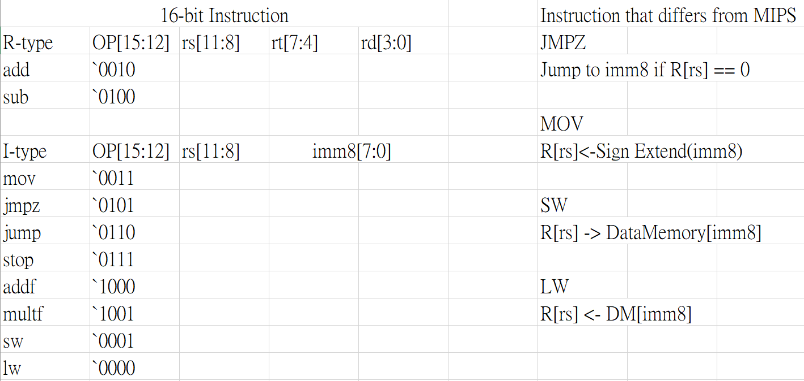
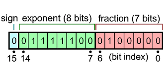
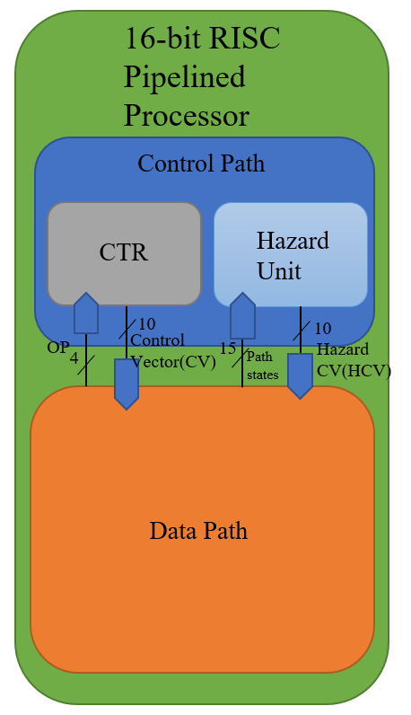
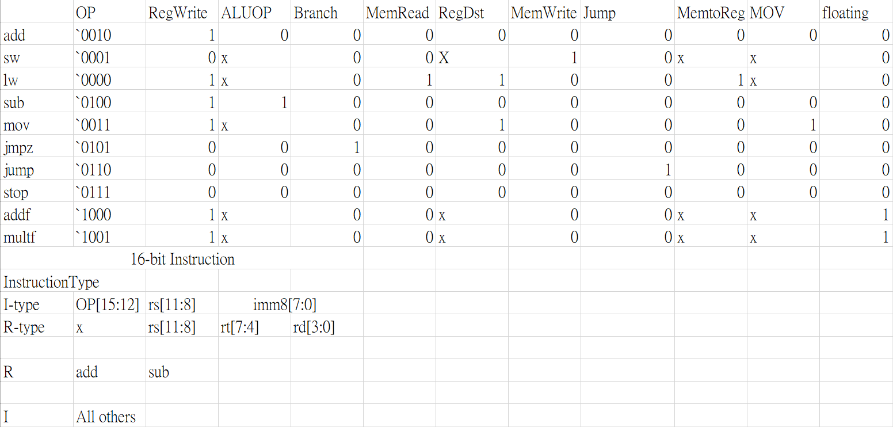
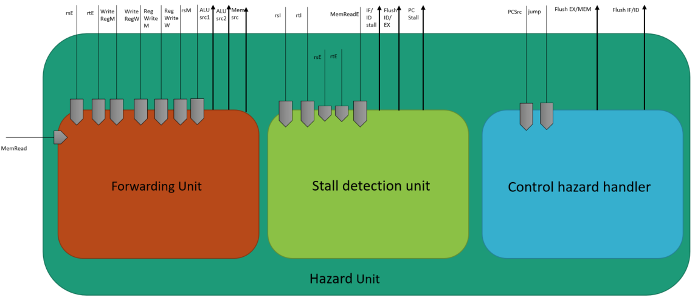
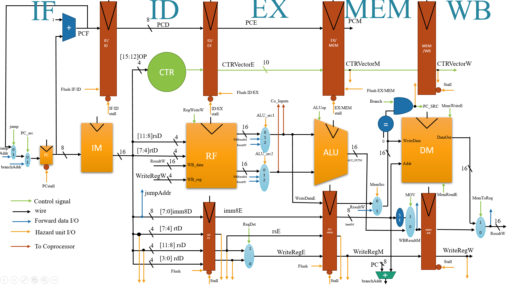
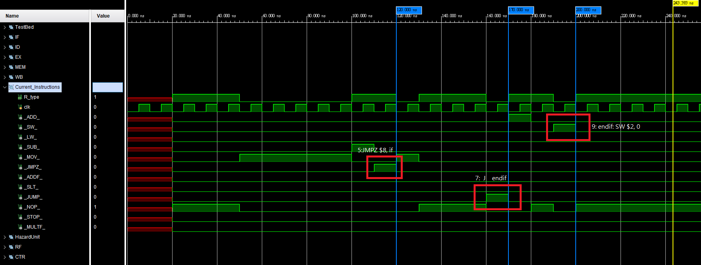
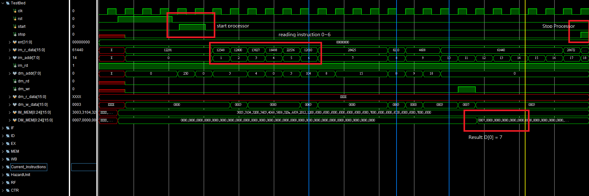
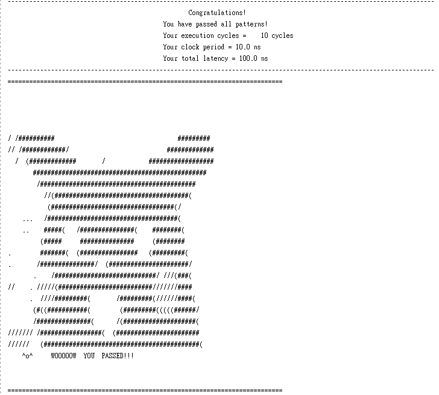
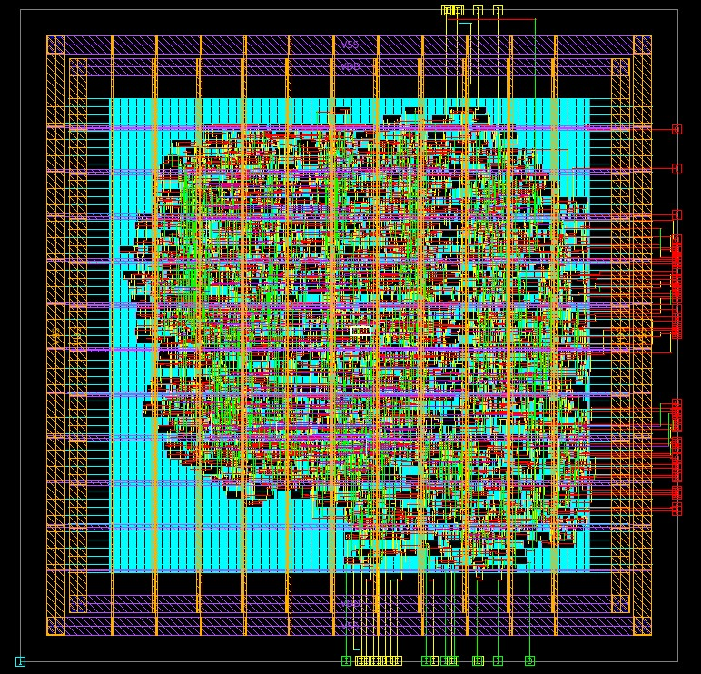

# <strong><font face = "Times New Roman"><p style="text-align: center;">16-bit custom RISC ISA pipelined processor with floating point Coprocessor</p></font></strong>
## <font face = "Times New Roman"><p style="text-align: center;">NCHU VLSI-CAD Final Project</p></font>
### <font face = "Times New Roman"><p style="text-align: center;">Shun-Linag Yeh,NCHU Lab612</p></font>
### <font face = "Times New Roman"><p style="text-align: center;">Instructor: Prof. Hun-Chun Lin</p></font>
### <font face = "Times New Roman"><p style="text-align: center;">December 2022</p></font>


# INDEX
1. [Introduction](#i-introduction)
2. [Instruction Set Architecture](#ii-custom-instruction-set-architectureisa)
3. [High level design](#iii-high-level-design)
4. [Software](#iv-software)
5. [MicroArchitecture](#v-microarhictecture)
6. [Results](#vi-results)
7. [FutureWorks](#vii-future-works)
8. [Acknowledgements](#viii-acknowledgements)
9.  [References](#ix-references)


# I. Introduction
<font face = "Times New Roman">


&nbsp;&nbsp;&nbsp;&nbsp;&nbsp;&nbsp;
In this project, I implemented a 5-stages custom RISC pipelined processor. To ensure performance and prevent wasted cycle due to stall, hazard units with stall control to resolve lw-r hazard, r-r hazard and control hazard is implemented.
<br />&nbsp;&nbsp;&nbsp;&nbsp;&nbsp;&nbsp;
This processor supports a small subset of Custom RISC-ISA, it supports ADD,SUBTRACTION,LW,SW and basic control flow instruction JUMP and JMPZ. Additional instruction like ADDF and MULTF are also implemented to support the basic floating point arithmetic.
<br />&nbsp;&nbsp;&nbsp;&nbsp;&nbsp;&nbsp;
The whole processor is built upon the Von-Neuman architecture. For simplicity, ideal memory is considered in this project. As a result, the instructions and data will be first loaded into the D-MEM and I-MEM in testbench then get fed into the processor.
<br />&nbsp;&nbsp;&nbsp;&nbsp;&nbsp;&nbsp;
The processor is divided into 5-stage, Instruction Decode(ID) stage Instruction Fetch(IF) stage
Execution(EX) stage Memory access(MEM) stage Write Back(WB) stage.

<div style="page-break-after: always;"></div>

# II. Custom Instruction Set Architecture(ISA)
<br />&nbsp;&nbsp;&nbsp;&nbsp;&nbsp;&nbsp;
The custom ISA I used is different from the original MIPS ISA, the original reference is from one of my lab senior past course where he implemented a multicycle processor under this ISA. This ISA has 2 types of instruction, R-type which performs numerical operation and floating point operations and I-type which performs immediate operation and Load-store memory.

<br />


## R-type
<font face = "Times New Roman">
&nbsp;&nbsp;&nbsp;&nbsp;&nbsp;&nbsp;
In this ISA, R-type has the same format as MIPS ISA.
</ font>


## I-type
<font face = "Times New Roman">
&nbsp;&nbsp;&nbsp;&nbsp;&nbsp;&nbsp;
I-type is different where source register is removed and the destination register $rt get replaced by $rs.


<div style="page-break-after: always;"></div>

# III. High Level Design
<font face = "Times New Roman">
&nbsp;&nbsp;&nbsp;&nbsp;&nbsp;&nbsp;
Partition the whole system into testbench, main processor and floating point coprocessor

## System Diagram


## 16-bit IEEE Floating-point format
<font face = "Times New Roman">
&nbsp;&nbsp;&nbsp;&nbsp;&nbsp;&nbsp;
IEEE-754 half precision floating point format is used for the implementation of my Coprocessor.<br />

<p align="center">
  
</p>

<div style="page-break-after: always;"></div>

# IV. Software
&nbsp;&nbsp;&nbsp;&nbsp;&nbsp;&nbsp;
<font face = "Times New Roman">
&nbsp;&nbsp;&nbsp;&nbsp;&nbsp;&nbsp;
I provided 6 test cases written in assembly code for my processor, each
tests resolves some issues for my processor. To ensure that my
processor is working as expected. Below is one of my test case.
## Test5
```C
  int a = 3;
  int b = 4;
  int c = 0;
  if(a == 3)
    c = a + b;
  else
    c = 10;

  D[0] = c;

```

Assembly
```python
0:            mov  $0,3  # a = 3
1:            mov  $1,4  # b = 4
2:            mov  $2,0  # c = 0
3:            mov  $6,3  # $t1 = 3
4:            sub  $8,$0,$6 # if((a-3 == 0))
5:            jmpz $8,if
6:            mov  $2,10
7:            j    endif
8:if:         add $2,$0,$1 # c = a + b
9:endif:      sw  $2,0     # D[0]  = c = 7;
nop
nop
nop
nop
nop
nop
nop
stop


```

<div style="page-break-after: always;"></div>

Machine Code
```
0: 0011_0000_0000_0011
1: 0011_0001_0000_0100
2: 0011_0010_0000_0000
3: 0011_0110_0000_0011
4: 0100_0000_0110_1000
5: 0101_1000_0000_1000
6: 0011_0010_0000_1010
7: 0110_1111_0000_1001
8: 0010_0000_0001_0010
9: 0001_0010_0000_0000
10:1111_0000_0000_0000
   1111_0000_0000_0000
   1111_0000_0000_0000
   1111_0000_0000_0000
   1111_0000_0000_0000
   1111_0000_0000_0000
   1111_0000_0000_0000
   0111_0000_0000_0000

```


<div style="page-break-after: always;"></div>

# V. MicroArchitecture
## Processor block diagram
&nbsp;&nbsp;&nbsp;&nbsp;&nbsp;&nbsp;
<font face = "Times New Roman">
&nbsp;&nbsp;&nbsp;&nbsp;&nbsp;&nbsp;
The processor is divided into 3 parts. Main pipelined datapath for the data flow and 2 controls units. One for Hazard handling and one as Main CTR to govern the flow control in the datapath.
<p align="center">
  
</p>

<div style="page-break-after: always;"></div>

# Control path
## Main Control
<font face = "Times New Roman">
&nbsp;&nbsp;&nbsp;&nbsp;&nbsp;&nbsp;
The decoded control vector is provided for the OP code given. The control vector would govern the data flow within the processor.

<p align="center">
  
</p>

# Hazard Units
<font face = "Times New Roman">
&nbsp;&nbsp;&nbsp;&nbsp;&nbsp;&nbsp;
Hazard units comprised of 3 parts.
Forwarding units which resolves the R-R and sw-r hazards.
Stall detection units which reseolves the R-LW hazards.
Control hazard Handler which handles control stall and flush<br />
<p align="center">
  
</p>

<div style="page-break-after: always;"></div>

# Forwarding Condition
>To solve Data hazard including R-R,sw-lw

<font face = "Times New Roman">

ALU_src1:
```verilog
    // In this ISA, lw does not need forwarding. also $0 can store value other than 0. Different from MIPS.
    if((rsE == WriteRegM) and (RegWriteM == 1) and (MemReadE != 1))
        ALU_src1 = 01
    else if ((rsE == WriteRegW) and (RegWriteW ==1 ) and (MemReadE != 1))
        ALU_src1 = 10
    else
        ALU_src1 = 00
```

<font face = "Times New Roman">

ALU_src2:
```verilog
    if((rtE == WriteRegM) and (RegWriteM == 1) and (MemReadE != 1))
        ALU_src2 = 01
    else if ((rtE == WriteRegW) and (RegWriteW == 1) and (MemReadE != 1))
        ALU_src2 = 10
    else
        ALU_src2 = 00
```

<font face = "Times New Roman">

MemSrc:
> To solve sw-lw data hazard
```verilog
    if((rsM == WriteRegW) and (MemReadW == 1) and (MemWriteM == 1))
        MemSrc = 1
    else
        MemSrc = 0
```

<div style="page-break-after: always;"></div>

## Stall Condition
> To solve lw-r data hazard and stop signal

```verilog
    if(stop)
        stall Every Pipeline and PC
    else if( ((rsD==rsE) or (rtD == rsE)) and (MemReadE == 1) and (ID stage is R-type))
        stall PC and flush ID/EX
    else
        do nothing
```

## Control Hazard Control
> To solve j and branch hazard

```verilog
    if (PCSrc == 1 || jump == 1)
        flush EX/MEM and flush IF/ID and stallPC for 3 cycles
    else
        do nothing
```

# Datapath
<font face = "Times New Roman">
&nbsp;&nbsp;&nbsp;&nbsp;&nbsp;&nbsp;
The detailed structure of my pipelined datapath.
<p align="center">
  
</p>

<div style="page-break-after: always;"></div>

# VI. Results
## Simulation Results waveform of Test5
<p align="center">
  
</p>


<p align="center">
  
</p>


<p align="center">
  
</p>

<div style="page-break-after: always;"></div>

## Synthesis Report
<p align="center">
  
</p>

## Hardware APR
<p align="center">
  
</p>

<div style="page-break-after: always;"></div>

# VII. Future Works
<font face = "Times New Roman">

1. Branch Predictor can be added to further improve performance.
2. Practical memory with full memory hiearchy can be added to replace the I-MEM and D-MEM including caches.

3. Can add Exception handling mechanism.

4. Virtual address translation system and TLB can be implemented.


# VIII. Acknowledgements
&nbsp;&nbsp;&nbsp;&nbsp;&nbsp;&nbsp;
<font face = "Times New Roman">
&nbsp;&nbsp;&nbsp;&nbsp;&nbsp;&nbsp;
I would like to ackowledge Professor Lin for his precious insight throughout the whole CAD course. Also I want to thanks the support from my Lab seniors Hun-Rui Chan and Mo-xuan Xiongs' mentorship and guidance throughout the research, design and implementation of this project. Without them,
there would be no final implementation of this project.

# IX. References
```
[1] Yamin Li and Wanming Chu, "Aizup-a pipelined processor design and implementation on XILINX FPGA chip," 1996 Proceedings IEEE Symposium on FPGAs for Custom Computing Machines, 1996, pp. 98-106, doi: 10.1109/FPGA.1996.564755.

[2] N. Manjikian and J. Roth, "Performance enhancement and high-level specification of a pipelined processor in programmable logic," 2007 IEEE Northeast Workshop on Circuits and Systems, 2007, pp. 1340-1343, doi: 10.1109/NEWCAS.2007.4488017.

[3] K. D. Rao, P. V. Muralikrishna and C. Gangadhar, "FPGA Implementation of 32 Bit Complex Floating Point Multiplier Using Vedic Real Multipliers with Minimum Path Delay," 2018 5th IEEE Uttar Pradesh Section International Conference on Electrical, Electronics and Computer Engineering (UPCON), 2018, pp. 1-6, doi: 10.1109/UPCON.2018.8597031.

[4] David Money Harris, Sarah L. Harris , "Digital Design and Computer Architecture 2nd edition", Morgan Kaufmann, 2012.

[5] Onur Mutlu, "Digital Design & Computer Architecture (ETH Zürich, Spring 2020)"
```